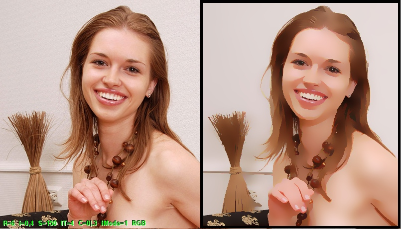



## Multipass BILATERAL FILTER\. \(V4\) \[better computation precision, RGB and CieLAB color Spaces\]

### Description

This application applies Multipass Bilateral Filter to color Images.

Bilateral filtering is an Edge-preserving smoothing filter. This technique extends the

concept of Gaussian smoothing by weighting the filter coefficients with their corresponding

relative pixel intensities. Pixels that are very different in intensity from the central

pixel are weighted less even though they may be in close proximity to the central pixel.

This is effectively a convolution with a non-linear Gaussian filter, with weights based on

pixel intensities. This is applied as two Gaussian filters at a localized pixel neighborhood

, one in the spatial domain, and one in the intensity domain.

Some Parameters make result image with a cartoon-like appearance.

[ can someone speed up EFF_BilateralFilter Sub? ]
 
### More Info
 

             |
---                |---
**Submitted On**   |2010-01-10 21:52:32
**By**             |[reexre](https://github.com/Planet-Source-Code/PSCIndex/blob/master/ByAuthor/reexre.md)
**Level**          |Intermediate
**User Rating**    |5.0 (25 globes from 5 users)
**Compatibility**  |VB 6\.0
**Category**       |[Graphics](https://github.com/Planet-Source-Code/PSCIndex/blob/master/ByCategory/graphics__1-46.md)
**World**          |[Visual Basic](https://github.com/Planet-Source-Code/PSCIndex/blob/master/ByWorld/visual-basic.md)
**Archive File**   |[Multipass\_2177223162010\.zip](https://github.com/Planet-Source-Code/reexre-multipass-bilateral-filter-v4-better-computation-precision-rgb-and-cielab-color-spa__1-73003/archive/master.zip)

